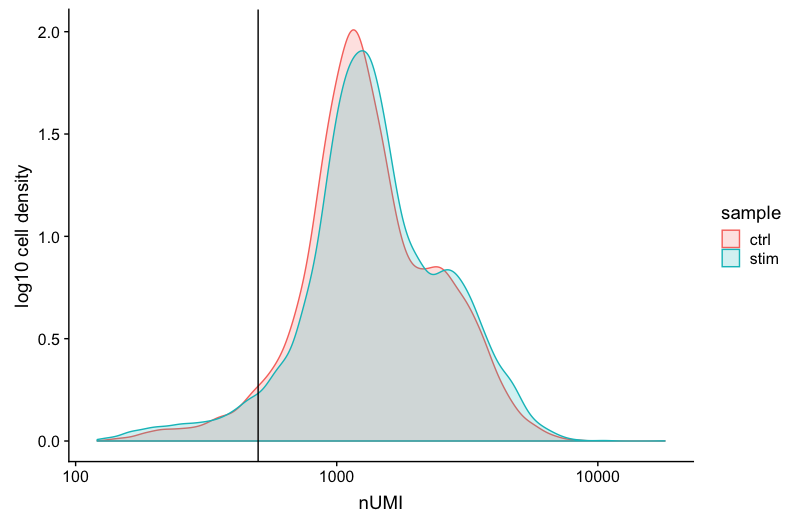
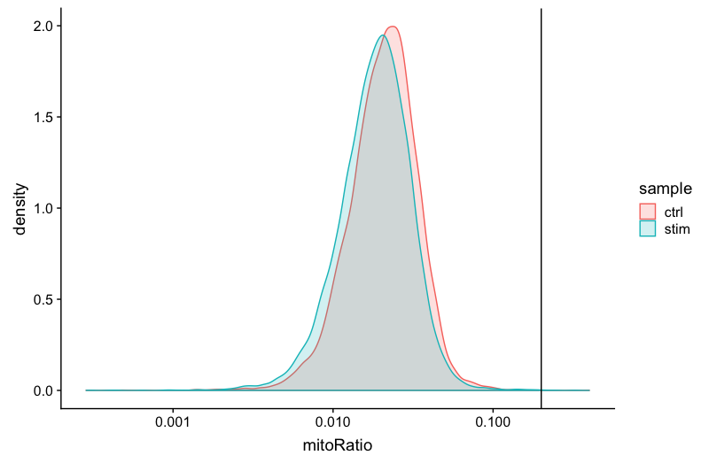

# Visualizing the single-cell RNA-seq workflow

_**By: Mary Piper (Pfizer) and Meeta Mistry (Harvard Chan Bioinformatics Core)**_

_**Materials adapted from the [Harvard Chan Bioinformatics Core's single-cell RNA-seq workshop](https://hbctraining.github.io/Intro-to-scRNAseq/schedule/links-to-lessons.html)**_

# Introduction

Something about how important data visualization is to performing a high-quality analysis.

# scRNA-seq workflow and prep

**Introduce the workflow very quickly**


_**Image credit:** Luecken, MD and Theis, FJ. Current best practices in single‐cell RNA‐seq analysis: a tutorial, Mol Syst Biol 2019 (doi: https://doi.org/10.15252/msb.20188746)_

The steps of the workflow are:

- **Generation of the count matrix (method-specific steps):** formating reads, demultiplexing samples, mapping and quantification
- **Quality control of the raw counts:** filtering of poor quality cells 
- **Clustering of filtered counts:** clustering cells based on similarities in transcriptional activity (cell types = different clusters)
- **Marker identification and cluster annotation:** identifying gene markers for each cluster and annotating known cell type clusters
- **Optional downstream steps**

Regardless of the analysis being done, conclusions about a population based on a single sample per condition are not trustworthy. **BIOLOGICAL REPLICATES ARE STILL NEEDED!** That is, if you want to make conclusions that correspond to the population and not just the single sample. 

**Highlight experimental considerations: replicates, pooling, batching**


# Raw data processing
**Should we mention cellRanger and/or include a cliff-knee plot?** Yes, add to this section

# Quality control

<p align="center">

</p>

_**Goals:**_ 
 
 - _To **filter the data to only include true cells that are of high quality**, so that when we cluster our cells it is easier to identify distinct cell type populations_
 - _To **identify any failed samples** and either try to salvage the data or remove from analysis, in addition to, trying to understand why the sample failed_

_**Challenges:**_
 
 - _Delineating cells that are **poor quality from less complex cells**_
 - _Choosing appropriate thresholds for filtering, so as to **keep high quality cells without removing biologically relevant cell types**_

_**Recommendations:**_
 
 - _Have a good idea of your expectations for the **cell types to be present** prior to performing the QC. For instance, do you expect to have low complexity cells or cells with higher levels of mitochondrial expression in your sample? If so, then we need to account for this biology when assessing the quality of our data._

## Assessing the quality metrics

To determine low quality cells that should be removed from the analysis, various metrics are assessed:

- Cell counts
- UMI counts per cell
- Genes detected per cell
- Complexity (novelty score)
- Mitochondrial counts ratio


> **What about doublets?** In single-cell RNA sequencing experiments, doublets are generated from two cells. They typically arise due to errors in cell sorting or capture, especially in droplet-based protocols involving thousands of cells. Doublets are obviously undesirable when the aim is to characterize populations at the single-cell level. In particular, they can incorrectly suggest the existence of intermediate populations or transitory states that do not actually exist. Thus, it is desirable to remove doublet libraries so that they do not compromise interpretation of the results.

> **Why aren't we checking for doublets?** Many workflows use maximum thresholds for UMIs or genes, with the idea that a much higher number of reads or genes detected indicate multiple cells. While this rationale seems to be intuitive, it is not accurate. Also, many of the tools used to detect doublets tend to get rid of cells with intermediate or continuous phenotypes, although they may work well on datasets with very discrete cell types. [Scrublet](https://github.com/AllonKleinLab/scrublet) is a popular tool for doublet detection, but we haven't adequately benchmarked it yet. Currently, we recommend not including any thresholds at this point in time. When we have identified markers for each of the clusters, we suggest exploring the markers to determine whether the markers apply to more than one cell type.

### Cell counts

The cell counts are determined by the number of unique cellular barcodes detected. For this experiment, between 12,000 -13,000 cells are expected.

In an ideal world, you would expect the number of unique cellular barcodes to correpsond to the number of cells you loaded. However, this is not the case as capture rates of cells are only a proportion of what is loaded. For example, the inDrops cell **capture efficiency** is higher (70-80%) compared to 10X which is between 50-60%.

> _**NOTE:** The capture efficiency could appear much lower if the cell concentration used for library preparation was not accurate. Cell concentration should NOT be determined by FACS machine or Bioanalyzer (these tools are not accurate for concentration determination), instead use a hemocytometer or automated cell counter for calculation of cell concentration._

The cell numbers can also vary by protocol, **producing cell numbers that are much higher than what we loaded**. For example, during the inDrops protocol, the cellular barcodes are present in the hydrogels, which are encapsulated in the droplets with a single cell and lysis/reaction mixture. While each hydrogel should have a single cellular barcode associated with it, occasionally a hydrogel can have more than one cellular barcode. Similarly, with the 10X protocol there is a chance of obtaining only a barcoded bead in the emulsion droplet (GEM) and no actual cell.  Both of these, in addition to the presence of dying cells can lead to a higher number of cellular barcodes than cells.

```r
# Visualize the number of cell counts per sample
metadata %>% 
  	ggplot(aes(x=sample, fill=sample)) + 
  	geom_bar() +
  	theme_classic() +
  	theme(axis.text.x = element_text(angle = 45, vjust = 1, hjust=1)) +
  	theme(plot.title = element_text(hjust=0.5, face="bold")) +
  	ggtitle("NCells")
```

<p align="center">

</p>

We see over 15,000 cells per sample, which is quite a bit more than the 12-13,000 expected. It is clear that we likely have some junk 'cells' present.

### UMI counts (transcripts) per cell

The UMI counts per cell should generally be above 500, that is the low end of what we expect. If UMI counts are between 500-1000 counts, it is usable but the cells probably should have been sequenced more deeply. 

```r
# Visualize the number UMIs/transcripts per cell
metadata %>% 
  	ggplot(aes(color=sample, x=nUMI, fill= sample)) + 
  	geom_density(alpha = 0.2) + 
  	scale_x_log10() + 
  	theme_classic() +
  	ylab("Cell density") +
  	geom_vline(xintercept = 500)
```

<p align="center">

</p>

We can see that majority of our cells in both samples have 1000 UMIs or greater, which is great. 


### Genes detected per cell

We have similar expectations for gene detection as for UMI detection, although it may be a bit lower than UMIs. For high quality data, the proportional histogram should contain **a single large peak that represents cells that were encapsulated**. If we see a **small shoulder** to the left of the major peak (not present in our data), or a bimodal distribution of the cells, that can indicate a couple of things. It might be that there are a set of **cells that failed** for some reason. It could also be that there are **biologically different types of cells** (i.e. quiescent cell populations, less complex cells of interest), and/or one type is much smaller than the other (i.e. cells with high counts may be cells that are larger in size). Therefore, this threshold should be assessed with other metrics that we describe in this lesson.
 

```r
# Visualize the distribution of genes detected per cell via histogram
metadata %>% 
  	ggplot(aes(color=sample, x=nGene, fill= sample)) + 
  	geom_density(alpha = 0.2) + 
  	theme_classic() +
  	scale_x_log10() + 
  	geom_vline(xintercept = 300)

```

<p align="center">

</p>


### Complexity

We can evaluate each cell in terms of how complex the RNA species are by using a measure called the novelty score. The novelty score is computed by taking the ratio of nGenes over nUMI. If there are many captured transcripts (high nUMI) and a low number of genes detected in a cell, this likely means that you only captured a low number of genes and simply sequenced transcripts from those lower number of genes over and over again. These low complexity (low novelty) cells could represent a specific cell type (i.e. red blood cells which lack a typical transcriptome), or could be due to an artifact or contamination. Generally, we expect the novelty score to be above 0.80 for good quality cells.

```r
# Visualize the overall complexity of the gene expression by visualizing the genes detected per UMI (novelty score)
metadata %>%
  	ggplot(aes(x=log10GenesPerUMI, color = sample, fill=sample)) +
  	geom_density(alpha = 0.2) +
  	theme_classic() +
  	geom_vline(xintercept = 0.8)
```

<p align="center">

</p>

### Mitochondrial counts ratio

This metric can identify whether there is a large amount of **mitochondrial contamination from dead or dying cells**. We define poor quality samples for mitochondrial counts as cells which surpass the 0.2 mitochondrial ratio mark, unless of course you are expecting this in your sample.

```r
# Visualize the distribution of mitochondrial gene expression detected per cell
metadata %>% 
  	ggplot(aes(color=sample, x=mitoRatio, fill=sample)) + 
  	geom_density(alpha = 0.2) + 
  	scale_x_log10() + 
  	theme_classic() +
  	geom_vline(xintercept = 0.2)
```

<p align="center">

</p>

> **NOTE:** **Reads per cell** is another metric that can be useful to explore; however, the workflow used would need to save this information to assess. Generally, with this metric you hope to see all of the samples with peaks in relatively the same location between 10,000 and 100,000 reads per cell. 


### Joint filtering effects

Considering any of these QC metrics in isolation can lead to misinterpretation of cellular signals. For example, cells with a comparatively high fraction of mitochondrial counts may be involved in respiratory processes and may be cells that you would like to keep. Likewise, other metrics can have other biological interpretations.  A general rule of thumb when performing QC is to **set thresholds for individual metrics to be as permissive as possible, and always consider the joint effects** of these metrics. In this way, you reduce the risk of filtering out any viable cell populations. 


Two metrics that are often evaluated together are the number of UMIs and the number of genes detected per cell. Here, we have plotted the **number of genes versus the number of UMIs coloured by the fraction of mitochondrial reads**. Jointly visualizing the count and gene thresholds and additionally overlaying the mitochondrial fraction, gives a summarized persepective of the quality per cell.

```r
# Visualize the correlation between genes detected and number of UMIs and determine whether strong presence of cells with low numbers of genes/UMIs
metadata %>% 
  	ggplot(aes(x=nUMI, y=nGene, color=mitoRatio)) + 
  	geom_point() + 
	scale_colour_gradient(low = "gray90", high = "black") +
  	stat_smooth(method=lm) +
  	scale_x_log10() + 
  	scale_y_log10() + 
  	theme_classic() +
  	geom_vline(xintercept = 500) +
  	geom_hline(yintercept = 250) +
  	facet_wrap(~sample)
```

<p align="center">

</p>

Good cells will generally exhibit both higher number of genes per cell and higher numbers of UMIs (upper right quadrant of the plot). Cells that are **poor quality are likely to have low genes and UMIs per cell**, and correspond to the data points in the bottom left quadrant of the plot. With this plot we also evaluate the **slope of the line**, and any scatter of data points in the **bottom right hand quadrant** of the plot. These cells have a high number of UMIs but only a few number of genes. These could be dying cells, but also could represent a population of a low complexity celltype (i.e red blood cells).

**Mitochondrial read fractions are only high in particularly low count cells with few detected genes** (darker colored data points). This could be indicative of damaged/dying cells whose cytoplasmic mRNA has leaked out through a broken membrane, and thus, only mRNA located in the mitochondria is still conserved. We can see from the plot, that these cells are filtered out by our count and gene number thresholds. 


After deciding on our quality thresholds and filtering the data, we would re-run the plots to ensure good quality metrics post-filtering. Based on the quality filtering, we should now have true cells of high quality and identified any failed samples.


# Normalization

<p align="center">

</p>

_**Goals:**_ 
 
 - _To accurately **normalize the gene expression values** to account for differences in sequencing depth and overdispersed count values._
 - _To **identify the most variant genes** likely to be indicative of the different cell types present._

_**Challenges:**_
 
 - _**Checking and removing unwanted variation** so that we do not have cells clustering by artifacts downstream_

_**Recommendations:**_
 
 - _Have a good idea of your expectations for the **cell types to be present** prior to performing the clustering. Know whether you expect cell types of low complexity or higher mitochondrial content AND whether the cells are differentiating_
 - _**Regress out** number of UMIs (default using sctransform), mitochondrial content, and cell cycle, if needed and appropriate for experiment, so not to drive clustering downstream_
 
***

An essential first step in the majority of mRNA expression analyses is normalization, whereby systematic variations are adjusted for to **make expression counts comparable across genes and cells**. The counts of mapped reads for each gene is proportional to the expression of RNA ("interesting") in addition to many other factors ("uninteresting"). Normalization is the process of adjusting raw count values to account for the "uninteresting" factors. 

Each cell in scRNA-seq will have a differing number of reads associated with it. So to accurately compare expression between cells, it is necessary to normalize for sequencing depth. Accounting for sequencing depth is necessary for comparison of gene expression between cells. 

In the example below, each gene appears to have doubled in expression in cell 2, however this is a consequence of cell 2 having twice the sequencing depth.

<p align="center">

</p>

To move forward with normalization, we need to decide whether there are any large sources of uninteresting variation that we would like to remove, including cell cycle differences or mitochondrial gene expression. To do this we explore the PCA plots of the genes associated with these sources.

**Plots for cell cycle and/or mitochondrial ratio.**

**Any other plots desired?**

After performing the normalization and regressing out any large sources of variation due to cell cycle and/or mitochondrial ratio, we can decide whether we need to perform integration.

# Integration

<p align="center">

</p>

***

_**Goals:**_ 

 - _To **align same cell types** across conditions._

_**Challenges:**_
 
 - _**Aligning cells of similar cell types** so that we do not have clustering downstream due to differences between samples, conditions, modalities, or batches_

_**Recommendations:**_
 
 - _Go through the analysis without integration first to determine whether integration is necessary_

***

## To integrate or not to integrate?

Generally, we always look at our clustering **without integration** before deciding whether we need to perform any alignment. **Do not just always perform integration because you think there might be differences - explore the data.** If we had performed the normalization on both conditions together in a Seurat object and visualized the similarity between cells, we would have seen condition-specific clustering:

<p align="center">

</p>

Condition-specific clustering of the cells indicates that we need to integrate the cells across conditions to ensure that cells of the same cell type cluster together. 

**Why is it important the cells of the same cell type cluster together?** 

We want to identify  _**cell types which are present in all samples/conditions/modalities**_ within our dataset, and therefore would like to observe a representation of cells from both samples/conditions/modalities in every cluster. This will enable more interpretable results downstream (i.e. DE analysis, ligand-receptor analysis, differential abundance analysis...).

To integrate, we will use the shared highly variable genes (identified using SCTransform) from each group, then, we will "integrate" or "harmonize" the groups to overlay cells that are similar or have a "common set of biological features" between groups. Integration is a powerful method that uses these shared sources of greatest variation to identify shared subpopulations across conditions or datasets [[Stuart and Bulter et al. (2018)](https://www.biorxiv.org/content/early/2018/11/02/460147)]. The goal of integration is to ensure that the cell types of one condition/dataset align with the same celltypes of the other conditions/datasets (e.g. macrophages in one sample align with macrophages in the other samples).


Different types of methods for integration exist....after we finished, we would visualize the aligned data in a UMAP to ensure proper alignment across our samples.

```r
# Plot UMAP split by sample
DimPlot(seurat_integrated)  
```


```r
# Plot UMAP split by sample
DimPlot(seurat_integrated,
        split.by = "sample")  
```

<p align="center">

</p>

# Clustering cells

**Heatmap or elbow plot?**

**UMAP**

# Identification of cell types

**Plotting known markers: UMAP, FeaturePlot, DotPlot**

**Marker ID**

**Cell type-assigned UMAP**
