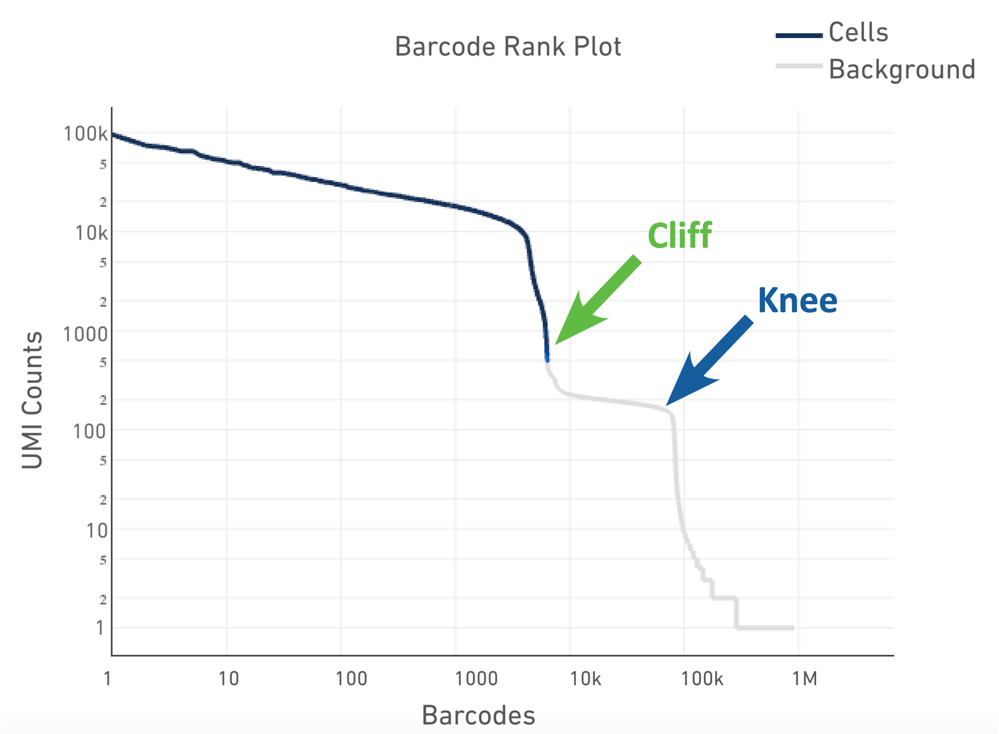
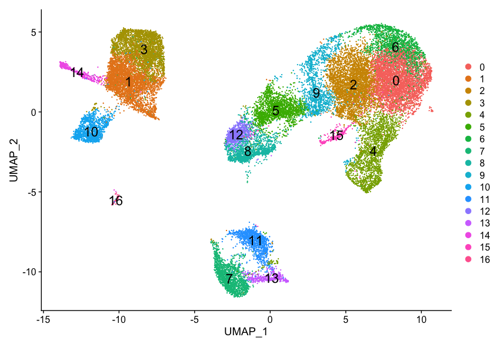
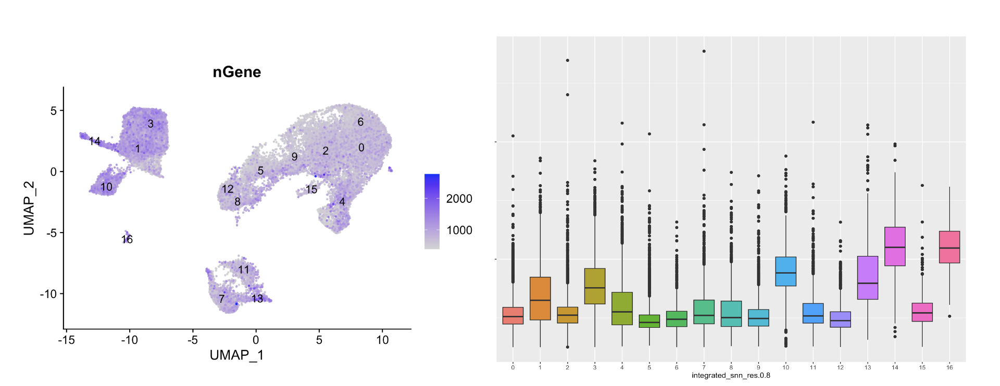

# Visualizing the single-cell RNA-seq workflow

_**By: Mary Piper (Pfizer) and Meeta Mistry (Harvard Chan Bioinformatics Core)**_

_**Materials adapted from the [Harvard Chan Bioinformatics Core's single-cell RNA-seq workshop](https://hbctraining.github.io/Intro-to-scRNAseq/schedule/links-to-lessons.html)**_

# Introduction
Visualization methods are critical when analyzing single-cell RNA sequencing (scRNA-seq) data because it enables researchers to interpret complex, high-dimensional datasets in an intuitive and accessible way. When evaluating the quality of the data, boxplots and violin plots are used to display the spread and central tendency of gene expression levels across cells or clusters. By using methods such as PCA, UMAP, or heatmaps, we can uncover patterns, clusters, and relationships among cells, identify rare cell populations, and detect cellular heterogeneity that might be missed with numerical analyses alone. Effective visualizations facilitate hypothesis generation, validation of biological findings, and communication of results to both specialized and broad audiences, ultimately driving deeper insight into single-cell transcriptomics.

In this short tutorial, we will highlight some key visualizations that are should be considered when performing a single cell RNA-seq analysis.

# scRNA-seq Workflow
In the figure below, a general overview is presented outlining the specific steps of the single cell RNA-seq workflow. The main steps include:

- **Generation of the count matrix (method-specific steps):** formatting reads, demultiplexing samples, mapping and quantification
- **Quality control of the raw counts:** filtering of poor quality cells
- **Normalization and exploring unwanted variation**: identifying highly variable genes/features, stabilizing variance, data exploration
- **Integration (batch correction):**
- **Clustering of filtered counts:** clustering cells based on similarities in transcriptional activity (cell types = different clusters)
- **Marker identification and cluster annotation:** identifying gene markers for each cluster and annotating known cell type clusters
- **Optional downstream steps**: differential expression analysis, trajectory inference, composition analysis

<p align="center">

</p>

_**Image credit:** Luecken, MD and Theis, FJ. Current best practices in single‐cell RNA‐seq analysis: a tutorial, Mol Syst Biol 2019 (doi: https://doi.org/10.15252/msb.20188746)_

> **NOTE:** Not included in the workflow above, **but equally, if not more important** are the **experimental design considerations**! As you begin to think about your single cell experiment, ask yourself the following:
> 1. Do you absolutely need single cell resolution? Would a FACS sort + bulk RNA-seq analysis suffice for the biological question?
> 2. Do you have biological replicates? Conclusions about a population of cells based on a single sample per condition are not trustworthy. **Biological replicates are necessary!**
>    * **Do not pool your biological replicates.** If you have limited tissue or very few cells, pool the same number of samples for every biological replicate.
> 4. Do you have batch effects? Best practice is to design the experiment in a way such that **technical variability is minimized between samples**. However, with large sample sizes it is impossible to prepare everything at once and so it is recommended to split replicates across batches. Also, be sure to keep track all sample-level metadata as it can be helpful in interpretation of results.
>


# Quality control

_**Goals:**_ 
 
 - _To **filter the data to only include true cells that are of high quality**, so that when we cluster our cells it is easier to identify distinct cell type populations_
 - _To **identify any failed samples** and either try to salvage the data or remove from analysis, in addition to, trying to understand why the sample failed_

## Sequencing read quality
A first step in quality assessment of data is to evaluate some key sequence read metrics which can help identify technical artifacts and ensure robust downstream analyses. Some examples of these include:

* **Mean Reads per Cell**: the total number of sequenced reads divided by the number of cells. 10X recommends a minimum of 20,000 read pairs per cell.
* **Valid Barcodes**: shows the fraction of reads with barcodes that match the inclusion list after barcode correction. Low valid barcodes (<75%) may indicate sequencing issues or sample/library preparation issues.
* **Mapping Rate**: The percentage of reads that align successfully to the transcriptome.  Overall, we would like the reads mapped to the genome to be high (for example, >85% for mouse or human), but could vary depending on the species.
     * Intergenic reads should be low. Intronic reads can be higher when the sample is prepared from nuclei or cells with high-level of intron retention (i.e. neutrophils)
* **Fraction Reads in Cells**: shows the fraction of valid-barcode, confidently-mapped reads with cell-associated barcodes. Lower percentages (< 70%) indicate that a high level of ambient RNA partitioned into all (cell-containing and non-cell-containing) GEMs.
  
### Barcode rank plot

The barcode rank plot is **an important visualization which shows the distribution of UMI counts in barcodes**. All detected barcodes are plotted in decreasing order of the number of UMIs associated with that particular barcode. The **shape of these plots** can indicate a few different things about the sample:

* Typical: Clear cliff and knee with separation between cells and background.
* Heterogeneous: Bimodal plot with 2 cliffs and knees, with a clear divide between cells and background.
* Compromised: Round curve with a steep drop-off at the end whih indicated low quality due to many factors.
* Compromised: Defined cliff and knee, but with few barcodes detected could be due to inaccurate cell count or clogging.

<p align="center">

</p>


## Cell-level quality metrics
To determine low quality cells that should be removed from the analysis, various metrics are assessed. Below, we present visualizations to display these metrics across cells within each sample in our dataset. 

### Cell counts

The cell counts are determined by the number of unique cellular barcodes detected. In an ideal world, you would expect the number of unique cellular barcodes to correspond to the number of cells you loaded. However, this is not the case as capture rates of cells are only a proportion of what is loaded. 

> _**NOTE:** The capture efficiency could appear much lower if the cell concentration used for library preparation was not accurate. Cell concentration should NOT be determined by FACS machine or Bioanalyzer (these tools are not accurate for concentration determination), instead use a hemocytometer or automated cell counter for calculation of cell concentration._

The cell numbers can also vary by protocol, **producing cell numbers that are much higher than what we loaded**. Some examples of how this could happen include:

* The cellular barcodes are present in the emulsion droplet, with no actual cell.
* Occasionally a droplet can have more than one cellular barcode.
* Presence of dying cells can lead to a higher number of cellular barcodes than cells.

```r
# Visualize the number of cell counts per sample
metadata %>% 
  	ggplot(aes(x=sample, fill=sample)) + 
  	geom_bar() +
  	theme_classic() +
  	theme(axis.text.x = element_text(angle = 45, vjust = 1, hjust=1)) +
  	theme(plot.title = element_text(hjust=0.5, face="bold")) +
  	ggtitle("NCells")
```

<p align="center">

</p>

We see over 15,000 cells per sample, which is quite a bit more than the 12-13,000 expected. It is clear that we likely have some junk 'cells' present.

### UMI counts per cell
The UMI counts per cell should generally be above 500, that is the low end of what we expect. If UMI counts are between 500-1000 counts, it is usable but the cells probably should have been sequenced more deeply. 


### Genes detected per cell
We have similar expectations for gene detection as for UMI detection, although it may be a bit lower than UMIs. For high quality data, the proportional histogram should contain **a single large peak that represents cells that were encapsulated**. 

If we see a **small shoulder** to the left of the major peak (not present in our data), or a bimodal distribution of the cells, that can indicate a couple of things. It might be that there are a set of **cells that failed** for some reason. It could also be that there are **biologically different types of cells** (i.e. quiescent cell populations, less complex cells of interest), and/or one type is much smaller than the other (i.e. cells with high counts may be cells that are larger in size). Therefore, this threshold should be assessed with other metrics.
 

```r
# Visualize the distribution of genes detected per cell via histogram
metadata %>% 
  	ggplot(aes(color=sample, x=nGene, fill= sample)) + 
  	geom_density(alpha = 0.2) + 
  	theme_classic() +
  	scale_x_log10() + 
  	geom_vline(xintercept = 300)

```

<p align="center">

</p>

### Fraction of reads mapping to mitochondrial genes
This metric can identify whether there is a large amount of **mitochondrial contamination from dead or dying cells**. We define poor quality samples for mitochondrial counts as cells which surpass the 0.2 mitochondrial ratio mark, unless of course you are expecting this in your sample.

### Joint filtering
Considering any of these QC metrics in isolation can lead to misinterpretation of cellular signals. For example, cells with a comparatively high fraction of mitochondrial counts may be involved in respiratory processes and may be cells that you would like to keep. Likewise, other metrics can have other biological interpretations.  A general rule of thumb when performing QC is to **set thresholds for individual metrics to be as permissive as possible, and always consider the joint effects** of these metrics. In this way, you reduce the risk of filtering out any viable cell populations. 

Two metrics that are often evaluated together are the number of UMIs and the number of genes detected per cell. Here, we have plotted the **number of genes versus the number of UMIs coloured by the fraction of mitochondrial reads**. Jointly visualizing the count and gene thresholds and additionally overlaying the mitochondrial fraction, gives a summarized persepective of the quality per cell.


```r
# Visualize the correlation between genes detected and number of UMIs and determine whether strong presence of cells with low numbers of genes/UMIs
metadata %>% 
  	ggplot(aes(x=nUMI, y=nGene, color=mitoRatio)) + 
  	geom_point() + 
	scale_colour_gradient(low = "gray90", high = "black") +
  	stat_smooth(method=lm) +
  	scale_x_log10() + 
  	scale_y_log10() + 
  	theme_classic() +
  	geom_vline(xintercept = 500) +
  	geom_hline(yintercept = 250) +
  	facet_wrap(~sample)
```

<p align="center">

</p>

Good cells will generally exhibit both higher number of genes per cell and higher numbers of UMIs (upper right quadrant of the plot). Cells that are **poor quality are likely to have low genes and UMIs per cell**, and correspond to the data points in the bottom left quadrant of the plot. With this plot we also evaluate the **slope of the line**, and any scatter of data points in the **bottom right hand quadrant** of the plot. These cells have a high number of UMIs but only a few number of genes. These could be dying cells, but also could represent a population of a low complexity celltype (i.e red blood cells).

**Mitochondrial read fractions are only high in particularly low count cells with few detected genes** (darker colored data points). This could be indicative of damaged/dying cells whose cytoplasmic mRNA has leaked out through a broken membrane, and thus, only mRNA located in the mitochondria is still conserved. We can see from the plot, that these cells are filtered out by our count and gene number thresholds. 

After deciding on our quality thresholds and filtering the data, we would re-run the plots to ensure good quality metrics post-filtering. Based on the quality filtering, we should now have true cells of high quality and identified any failed samples.


# Normalization and regressing out unwanted variation

_**Goals:**_ 
 
 - _To accurately **normalize the gene expression values** to account for differences in sequencing depth and overdispersed count values._
 - _To **identify the most variant genes** likely to be indicative of the different cell types present._
 - _**Checking and removing unwanted variation** so that we do not have cells clustering by artifacts downstream_


An essential first step in the majority of mRNA expression analyses is normalization, whereby systematic variations are adjusted for to **make expression counts comparable across genes and cells**. The counts of mapped reads for each gene is proportional to the expression of RNA ("interesting") in addition to many other factors ("uninteresting"). Normalization is the process of adjusting raw count values to account for the "uninteresting" factors. 

Before we make any comparisons across cells, we will **apply a simple normalization.** This is solely for the purpose of exploring the sources of variation in our data.

## Evaluating effects of cell cycle 

To assign each cell a score based on its expression of G2/M and S phase markers, we have used the Seurat function `CellCycleScoring()`. This function calculates cell cycle phase scores based on canonical markers that required as input. After scoring the cells for cell cycle, we would like to **determine whether cell cycle is a major source of variation in our dataset using PCA**. 

**LETS LOAD IN THE DATA (seurat_phase) IN WHICH A SIMPLE NORMALIZATION HAS BEEN APPLIED AND WHERE WE HAVE CELL CYCLE SCORES COMPUTED FOR EACH CELL + Find variable genes + ScaleData.**

```r
# Load in the Seurat object
seurat_phase <-

```

### Highly variable genes 
To perform PCA, we need to **first choose the most variable features, then scale the data**. Since highly expressed genes exhibit the highest amount of variation and we don't want our 'highly variable genes' only to reflect high expression, we need to scale the data to scale variation with expression level. 

Seurat allows us to access the ranked highly variable genes with the `VariableFeatures()` function. We can additionally **visualize the dispersion of all genes using Seurat's `VariableFeaturePlot()`**, which shows a gene's average expression across all cells on the x-axis and variance on the y-axis. Ideally we want to use genes that have high variance since this can indicate a change in expression depending on populations of cells. Adding labels using the `LabelPoints()` helps us understand which genes will be driving shape of our data.

```r
# Identify the 15 most highly variable genes
ranked_variable_genes <- VariableFeatures(seurat_phase)
top_genes <- ranked_variable_genes[1:15]

# Plot the average expression and variance of these genes
# With labels to indicate which genes are in the top 15
p <- VariableFeaturePlot(seurat_phase)
LabelPoints(plot = p, points = top_genes, repel = TRUE)
```

<p align="center">

</p>


### PCA

Principal Component Analysis (PCA) is a technique used to emphasize variation as well as similarity, and to bring out strong patterns in a dataset; it is one of the methods used for *"dimensionality reduction"*. 

> **NOTE:** For a more **detailed explanation on PCA**, please [look over this lesson](05_theory_of_PCA.md) (adapted from StatQuests/Josh Starmer's YouTube video). We also strongly encourage you to explore the video [StatQuest's video](https://www.youtube.com/watch?v=_UVHneBUBW0) for a more thorough understanding. 

```r
# Perform PCA
seurat_phase <- RunPCA(seurat_phase)

# Plot the PCA colored by cell cycle phase
DimPlot(seurat_phase,
        reduction = "pca",
        group.by= "Phase",
        split.by = "Phase")
```


<p align="center">

</p>


Here, we have performed the PCA analysis using the most highly variable genes and plotted the first two principal components against each other. We have also split the figure by cell cycle phase, to evaluate similarities and/or differences. **We do not see large differences due to cell cycle phase. Based on this plot, we would not regress out the variation due to cell cycle**.

<details>
	<summary><b><i>When should cell cycle phase be regressed out?</i></b></summary>
	<br>Below are two PCA plots taken from the Seurat vignette dealing with <a href="https://satijalab.org/seurat/archive/v3.1/cell_cycle_vignette.html">Cell-Cycle Scoring and Regression</a>.<br>

 	<ul><li>This first plot is similar to what we plotted above, it is a PCA prior to regression to evaluate if the cell cycle is playing a big role in driving PC1 and PC2. Clearly, the cells are separating by cell type in this case, so the vignette suggests regressing out these effects.</li></ul>
 	<p align="center">
 	
 	</p>

	<ul><li>This second PCA plot is <b>post-regression</b>, and displays how effective the regression was in removing the effect we observed.</li></ul>

	<p align="center">
	
	</p>
</details>

## SCTransform

In the [Hafemeister and Satija, 2019 paper](https://genomebiology.biomedcentral.com/articles/10.1186/s13059-019-1874-1) the authors explored the issues with simple transformations. Specifically they evaluated the standard log normalization approach and found that:

* genes with different abundances are affected differently and that **effective normalization (using the log transform) is only observed with low/medium abundance genes (Figure 1D, below)
* substantial imbalances in variance were observed with the log-normalized data (Figure 1E, below)
     * cells with low total UMI counts exhibited disproportionately higher variance for high-abundance genes, dampening the variance contribution from other gene abundances

<p align="center">

</p>

_**Image credit:** Hafemeister C and Satija R. Normalization and variance stabilization of single-cell RNA-seq data using regularized negative binomial regression, Genom Biology 2019 (https://doi.org/10.1101/576827)_

The conclusion is, **we cannot treat all genes the same.**

The proposed solution was the use of **Pearson residuals for transformation**, as implemented in Seurat's `SCTransform` function. With this approach:

* Measurements are multiplied by a gene-specific weight
* Each gene is weighted based on how much evidence there is that it is non-uniformly expressed across cells
* More evidence == more of a weight; Genes that are expressed in only a small fraction of cells will be favored (useful for finding rare cell populations)
* Not just a consideration of the expression level is, but also the distribution of expression


# Integration

_**Goals:**_ 

 - _To **align same cell types** so as not to have clustering downstream driven by differences between samples, conditions, modalities, or batches._

## To integrate or not to integrate?

Generally, we always look at our clustering **without integration** before deciding whether we need to perform any alignment. **Do not just always perform integration because you think there might be differences - explore the data.** If we had performed the normalization on both conditions together in a Seurat object and visualized the similarity between cells, we would have seen condition-specific clustering:

<p align="center">

</p>

Condition-specific clustering of the cells indicates that we need to integrate the cells across conditions to ensure that cells of the same cell type cluster together. 

**Why is it important the cells of the same cell type cluster together?** 

We want to identify  _**cell types which are present in all samples/conditions/modalities**_ within our dataset, and therefore would like to observe a representation of cells from both samples/conditions/modalities in every cluster. This will enable more interpretable results downstream (i.e. DE analysis, ligand-receptor analysis, differential abundance analysis...).

## Approaches for integration
To integrate, we will use the shared highly variable genes (identified using SCTransform) from each group, then, we will "integrate" or "harmonize" the groups to overlay cells that are similar or have a "common set of biological features" between groups. Integration is a powerful method that **uses these shared sources of greatest variation to identify shared subpopulations across conditions or datasets** [[Stuart and Bulter et al. (2018)](https://www.biorxiv.org/content/early/2018/11/02/460147)]. The goal of integration is to ensure that the cell types of one condition/dataset align with the same celltypes of the other conditions/datasets (e.g. macrophages in one sample align with macrophages in the other samples).

### Canonical Correlation Analysis (CCA)
CCA is a form of PCA, in that it identifies the greatest sources of variation in the data, but only if it is shared or conserved across the conditions/groups (using the 3000 most variant genes from each sample). The shared highly variable genes are used to identify anchors or mutual nearest neighbors (MNNs) across datasets and incorrect anchors are filtered out. The anchors and corresponding scores are used to transform the cell expression values, allowing for the integration of the conditions/datasets.

### Harmony
Harmony was devleoped in 2019, and is an example of a tool that can work with complex integration tasks (integrating across multiple covariates). Instead of using CCA, Harmony applies a transformation to the principal component (PCs) values, using all available PCs, e.g. as pre-computed within the Seurat workflow. In this space of transformed PCs, Harmony uses k-means clustering to delineate clusters, seeking to define clusters with maximum "diversity". 


For this dataset, we applied CCA integration. To **evaluate the effect of integration**, we can visualize the aligned data in a UMAP to ensure we now have proper alignment across our samples.

```r
# Plot UMAP
DimPlot(seurat_integrated)  
```

<p align="center">

</p>

```r
# Plot UMAP split by sample
DimPlot(seurat_integrated,
        split.by = "sample")  
```

<p align="center">

</p>

# Clustering cells

_**Goals:**_ 
 
 - _To **generate cell type-specific clusters** and use known cell type marker genes to determine the identities of the clusters._
 - _To **determine whether clusters represent true cell types or cluster due to biological or technical variation**, such as clusters of cells in the S phase of the cell cycle, clusters of specific batches, or cells with high mitochondrial content._

Seurat uses a graph-based clustering approach using a K-nearest neighbor approach, and then attempts to partition this graph into highly interconnected ‘quasi-cliques’ or ‘communities’ [[Seurat - Guided Clustering Tutorial](https://satijalab.org/seurat/v3.1/pbmc3k_tutorial.html)]. A nice in-depth description of clustering methods is provided in the [SVI Bioinformatics and Cellular Genomics Lab course](https://biocellgen-public.svi.edu.au/mig_2019_scrnaseq-workshop/clustering-and-cell-annotation.html).

The `resolution` is an important argument that sets the "granularity" of the downstream clustering and will need to be optimized for every individual experiment.  For datasets of 3,000 - 5,000 cells, the `resolution` set between `0.4`-`1.4` generally yields good clustering. Increased resolution values lead to a greater number of clusters, which is often required for larger datasets. 

To visualize the cell clusters, there are a few different dimensionality reduction techniques that can be helpful that aim to place cells with similar local neighborhoods in high-dimensional space together in low-dimensional space. These methods will require you to input number of PCA dimentions to use for the visualization. Here, we will proceed with the [UMAP method](https://umap-learn.readthedocs.io/en/latest/how_umap_works.html) for **visualizing the clusters at a resolution of 0.8**.

```r
# Assign identity of clusters
Idents(object = seurat_integrated) <- "integrated_snn_res.0.8"
```

```r
# Plot the UMAP
DimPlot(seurat_integrated,
        reduction = "umap",
        label = TRUE,
        label.size = 6)
```

<p align="center">

</p>


# Cluster QC and identification of cell types

_**Goals:**_ 
 
 - _To **determine whether clusters represent true cell types or cluster due to biological or technical variation**, such as clusters of cells in the S phase of the cell cycle, clusters of specific batches, or cells with high mitochondrial content._
 - _To use known cell type marker genes to **determine the identities of the clusters**._

## Exploration of QC metrics

Let's begin by using a **barplot** to take a look at the **number of cells per cluster**, and whether there are similar amounts of cells present from each of the conditions. Large differences observed could indicate compositional change between conditions and may warrant further downstream analysis.

```r
# Extract identity and sample information from seurat object to determine the number of cells per cluster per sample
n_cells <- FetchData(seurat_integrated, 
                     vars = c("ident", "sample")) %>%
        dplyr::count(ident, sample)

# Barplot of number of cells per cluster by sample
ggplot(n_cells, aes(x=ident, y=n, fill=sample)) +
    geom_bar(position=position_dodge(), stat="identity") +
    geom_text(aes(label=n), vjust = -.2, position=position_dodge(1))
```

<p align="center">

</p>


To determine whether our clusters might be due to artifacts such as cell cycle phase, mitochondrial expression, or junk, it can be useful to explore various metrics visually to see if any clusters exhibit enrichment or are different from the other clusters. If enrichment or differences are observed for particular clusters it may not be worrisome if it can be explained by the particular cell type. 

Next let's explore these metrics by overlaying them on the UMAP using a **FeaturePlot**: 

```r
# Determine metrics to plot present in seurat_integrated@meta.data
metrics <-  c("nUMI", "nGene", "S.Score", "G2M.Score", "mitoRatio")

FeaturePlot(seurat_integrated, 
            reduction = "umap", 
            features = metrics,
            pt.size = 0.4, 
            order = TRUE,
            min.cutoff = 'q10',
            label = TRUE)
```

<p align="center">

</p>

With the color scale of the FeaturePlots, it can be difficult to distinguish the precise effect on individual clusters. Next, we use **boxplots** to zoom in on the number of genes expressed in each cluster and more **quantitatively assess the differences**. The corresponding UMAP is displayed for comparison.

```r
# Boxplot of nGene per cluster
ggplot(seurat_integrated@meta.data) +
    geom_boxplot(aes(x=integrated_snn_res.0.8, y=nGene, fill=integrated_snn_res.0.8)) +
    NoLegend()
```

<p align="center">

</p>

## Exploring known celltype markers
We can explore the different clusters and best identify their cell type identities by looking at expression of known marker genes. Depending on our markers of interest, they could be positive or negative markers for a particular cell type. The combined expression of our chosen handful of markers should give us an idea on whether a cluster corresponds to that particular cell type. In teh example below, **CD14+ monocyte markers** appear to correspond to clusters 1, and 3. We wouldn't include clusters 14 and 10 because they do not highly express both of these markers.

### Feature Plot

```r
FeaturePlot(seurat_integrated, 
            reduction = "umap", 
            features = c("CD14", "LYZ"), 
            order = TRUE,
            min.cutoff = 'q10', 
            label = TRUE)
```

<p align="center">

</p>

### Violin plot
We can also explore the range in expression of specific markers by using **violin plots**. Violin plots are similar to box plots, except that they **also show the probability density of the data at different values**, usually smoothed by a kernel density estimator. A violin plot is more informative than a plain box plot. While a box plot only shows summary statistics such as mean/median and interquartile ranges, the violin plot shows the **full distribution of the data**. The difference is particularly useful when the data distribution is multimodal (more than one peak). In this case a violin plot shows the presence of different peaks, their position and relative amplitude.

```r
# Vln plot - CD14+ monocyte (need to run this code to create the image
VlnPlot(object = seurat_integrated, 
        features = c("CD14", "LYZ"))

```

### Dotplot
While the above plot allows you to explore one celltype at a time, Seurat also has a built in **visualization tool which allows us to view the average expression of genes across clusters called DotPlot()**. This function also shows us what percentage of cells within the cluster express the given gene (dot size). As input, we supply a list of genes - note that we cannot use the same gene twice or an error will be thrown.

```r
# List of known celltype markers
markers <- list()
markers[["CD14+ monocytes"]] <- c("CD14", "LYZ")
markers[["FCGR3A+ monocyte"]] <- c("FCGR3A", "MS4A7")
markers[["Macrophages"]] <- c("MARCO", "ITGAM", "ADGRE1")
markers[["Conventional dendritic"]] <- c("FCER1A", "CST3")
markers[["Plasmacytoid dendritic"]] <- c("IL3RA", "GZMB", "SERPINF1", "ITM2C")

# Create dotplot based on RNA expression
DotPlot(seurat_integrated, markers, assay="RNA")
```

<p align="center">

</p>

## Celltype assignment
After identifying the majority of clusters using known cell type markers, we can move on to marker identification, which will allow us to verify the identity of certain clusters and help surmise the identity of any unknown clusters. We can use the same plots to explore the expression of new markers as the known markers. Once we have identified the cell types, we can **assign the cell type names to each cluster**.

```r
# Rename all identities
seurat_integrated <- RenameIdents(object = seurat_integrated, 
                               "0" = "Naive or memory CD4+ T cells",
                               "1" = "CD14+ monocytes",
                               "2" = "Activated T cells",
                               "3" = "CD14+ monocytes",
                               "4" = "Stressed cells / Unknown",
                               "5" = "CD8+ T cells",
                               "6" = "Naive or memory CD4+ T cells",
                               "7" = "B cells",
                               "8" = "NK cells",
                               "9" = "CD8+ T cells",
                               "10" = "FCGR3A+ monocytes",
                               "11" = "B cells",
                               "12" = "NK cells",
                               "13" = "B cells",
                               "14" = "Conventional dendritic cells",
                               "15" = "Megakaryocytes",
			       "16" = "Plasmacytoid dendritic cells")


# Plot the UMAP
DimPlot(object = seurat_integrated, 
        reduction = "umap", 
        label = TRUE,
        label.size = 3,
        repel = TRUE)
```

<p align="center">

</p>

- Experimentally validate intriguing markers for our identified cell types.
- Explore a subset of the cell types to discover subclusters of cells as described [here](seurat_subclustering.md)
- Trajectory analysis, or lineage tracing, could be performed if trying to determine the progression between cell types or cell states. For example, we could explore any of the following using this type of analysis:
	- Differentiation processes
	- Expression changes over time
	- Cell state changes in expression

***
*This lesson has been developed by members of the teaching team at the [Harvard Chan Bioinformatics Core (HBC)](http://bioinformatics.sph.harvard.edu/). These are open access materials distributed under the terms of the [Creative Commons Attribution license](https://creativecommons.org/licenses/by/4.0/) (CC BY 4.0), which permits unrestricted use, distribution, and reproduction in any medium, provided the original author and source are credited.*

* *A portion of these materials and hands-on activities were adapted from the [Satija Lab's](https://satijalab.org/) [Seurat - Guided Clustering Tutorial](https://satijalab.org/seurat/pbmc3k_tutorial.html)*
